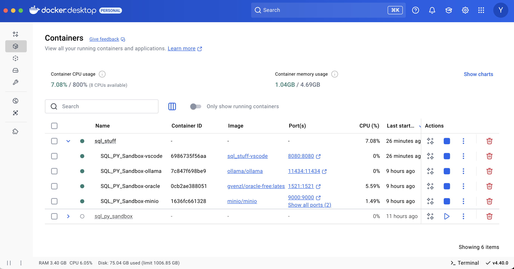

# Docker Analytics Sandbox

A comprehensive, containerized development environment for data analysts and data engineers, providing enterprise-grade tools at minimal cost. This project enables rapid development and testing of data pipelines, analytics workflows, and SaaS prototypes using industry-standard technologies.

## 🎓 Free for Education
This project is completely free for:
- University Students
- College Students
- Educational Institutions
- Self-Learners
- Anyone without access to paid subscription services

We believe in making enterprise-grade development tools accessible to everyone, especially students and learners who may not have access to expensive commercial solutions.



[](https://opensource.org/licenses/MIT)

## Component Licenses

This project integrates several components, each with its own license:
- Oracle Database XE: [OTN License Agreement](https://www.oracle.com/downloads/licenses/database-11g-express-edition-license.html)
- Docker: [Apache License 2.0](https://www.docker.com/legal/components-licenses)
- MinIO: [GNU AGPL v3](https://github.com/minio/minio/blob/master/LICENSE)
- VS Code Server: [MIT License](https://github.com/microsoft/vscode/blob/main/LICENSE.txt)

See [THIRD_PARTY_NOTICES.md](THIRD_PARTY_NOTICES.md) for detailed licensing information.

## Overview

This sandbox environment combines powerful data tools into a cohesive development platform, making enterprise tools accessible for educational purposes:

- **Oracle Database**: Enterprise-grade relational database for learning SQL and database management
- **MinIO**: S3-compatible object storage for understanding modern data lake architectures
- **VS Code Server**: Browser-based IDE with full development capabilities
- **Ollama**: Local AI model integration for learning AI/ML workflows

### Educational Benefits
- **No Subscription Costs**: Complete development environment at zero cost
- **Industry-Standard Tools**: Learn the same tools used in enterprise environments
- **Hands-On Experience**: Practical experience with real-world technologies
- **Local Development**: No cloud costs or credit card required
- **Comprehensive Learning**: From basic SQL to advanced data engineering

Current Resource Usage (as of April 2024):
- CPU Usage: 7.08% of 800% (8 CPUs available)
- Memory Usage: 1.04GB / 4.69GB
- Storage: Efficient container sizes with minimal overhead

## Value Proposition

### For Data Analysts
- Immediate access to enterprise-grade database tools
- Built-in data visualization capabilities
- SQL development environment with modern IDE features
- Local AI assistance for query optimization and data analysis
- No complex setup or installation required

### For Data Engineers
- Complete ETL development environment
- Version-controlled infrastructure as code
- Integration testing capabilities
- S3-compatible storage for data lake development
- Containerized workflow that mirrors production environments

### For SaaS Development
- Rapid prototyping environment
- Full stack development capabilities
- Scalable architecture patterns
- Built-in security features
- Easy deployment and testing

## Quick Start Connection Details

### Oracle Database Connections

#### VS Code Database Client Connection (Inside code-server)
```sql
Host: SQL_PY_Sandbox-oracle
Port: 1521
Service Name: FREE
Username: system
Password: oracle
Connection String: system/oracle@//SQL_PY_Sandbox-oracle:1521/FREE
```

#### External Connection (From your local machine)
```sql
Host: localhost
Port: 1521
Service Name: FREE
Username: system
Password: oracle
Connection String: system/oracle@//localhost:1521/FREE
```

### MinIO Object Storage
```
Internal API Endpoint: http://SQL_PY_Sandbox-minio:9000
External API Endpoint: http://localhost:9000
Web Console: http://localhost:9001
Access Key: minioadmin
Secret Key: minioadmin
Default Bucket: sql-scripts
```

### VS Code Server
```
URL: http://localhost:8080
```

### Ollama AI Integration
```
Internal Endpoint: http://SQL_PY_Sandbox-ollama:11434
External Endpoint: http://localhost:11434
```

## Directory Structure

- `scripts/`: Core scripts and utilities
  - `sql_files/`: SQL database management and query scripts
  - `python_files/`: Python ETL and data processing scripts
  - `shell_scripts/`: Automation and maintenance scripts
- `docs/`: Documentation and guides
- `config/`: Configuration files for all services
- `tests/`: Integration and unit tests

## Prerequisites

- Docker Desktop installed
- Minimum 8GB RAM recommended (4GB required)
- 20GB free disk space
- Git for version control

## Getting Started

1. Clone the repository:
   ```bash
   git clone https://github.com/YavinOwens/Docker_Analytics_Sandbox.git
   cd Docker_Analytics_Sandbox
   ```

2. Start the environment:
   ```bash
   docker-compose up -d
   ```

3. Access the development environment:
   - Open VS Code Server: http://localhost:8080
   - Access MinIO Console: http://localhost:9001
   - Connect to Oracle Database using the connection details above

## Troubleshooting

### Container Health Checks
- View container status: `docker ps`
- Check container logs: `docker logs <container-name>`
- Monitor resource usage: Docker Desktop Dashboard

### Database Connectivity
- Verify Oracle container health: `docker logs SQL_PY_Sandbox-oracle`
- Test connection: `sqlplus system/oracle@//localhost:1521/FREE`
- Check listener status inside container: `lsnrctl status`

### Storage Issues
- Verify MinIO accessibility: `curl http://localhost:9000`
- Check MinIO logs: `docker logs SQL_PY_Sandbox-minio`
- Monitor disk usage: `docker system df`

### IDE and Development
- Clear VS Code Server cache if needed
- Verify extension installations
- Check Ollama connectivity for AI features

## License

This project is licensed under the MIT License - see the [LICENSE](LICENSE) file for details.
Component licenses are detailed in [THIRD_PARTY_NOTICES.md](THIRD_PARTY_NOTICES.md).

Copyright (c) 2025 Yavin Owens

## Contributing

Contributions are welcome! Please feel free to submit a Pull Request. Make sure to read the [Contributing Guidelines](CONTRIBUTING.md) first.

For major changes, please open an issue first to discuss what you would like to change.

## Support for Students

### Getting Started Guide for Students
1. Install Docker Desktop (free for educational use)
2. Clone this repository
3. Follow the setup instructions above
4. Join our community discussions for help

### Educational Resources
- Check our [Wiki](../../wiki) for tutorials
- Sample datasets for learning
- Practice exercises and projects
- Community support for students
